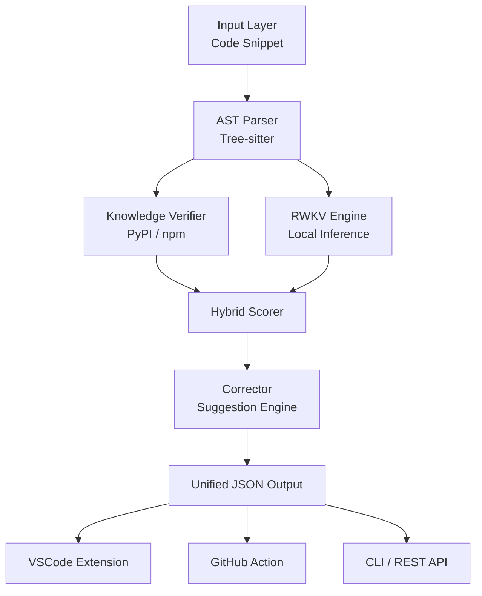

# HalluGuard AI Architecture

## Overview

HalluGuard AI is an open-source AI reliability layer designed to detect, explain, and correct hallucinations in AI-generated code. The system architecture is built around a hybrid approach combining static analysis (AST parsing), external knowledge verification, and local inference models (RWKV).

## System Flow



## Modules and Interfaces

### 1. AST Parser (`core.parser`)
Extracts imports, function calls, and method parameters from Python and JS/TS code using Tree-sitter. 
**Output:** Dictionary of imports, mapped functions, and raw tokens.

### 2. Knowledge Verifier (`core.verifier`)
Queries real-world package registries (`pypi.org/pypi/*/json`) to confirm the existence of extracted modules and methods.
**Output:** Authenticity status of each module with in-memory caching.

### 3. RWKV Engine (`core.rwkv_engine`)
A lightweight, fast, local RNN model that calculates sub-token confidence levels, preventing false positives and deeply hallucinated logic paths.
**Output:** Confidence Float (0-100).

### 4. Hallucination Scorer (`core.scorer`)
Aggregates logic traces and verified lists to produce a human-readable diagnosis and global risk factor.
**Output Universel:**

```json
{
  "file": "example.py",
  "risk_score": 74,
  "confidence": "HIGH",
  "hallucinations": [
    {
      "line": 12,
      "type": "unknown_function",
      "token": "fetchUserData()",
      "explanation": "Function not found in known libraries",
      "suggestion": "Use requests.get() instead",
      "severity": "HIGH"
    }
  ]
}
```
